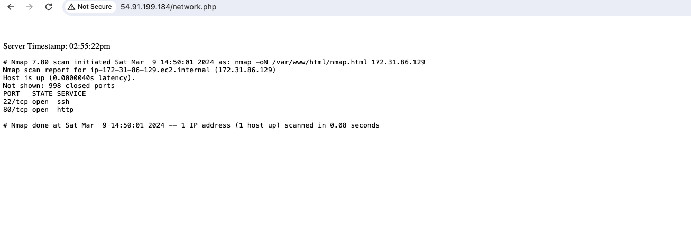

# Linux Project - Simple Network Scanner Web App (nmap)


## Project Overview:

This project enables the creation of a straightforward network scanner accessible via a web browser on the network.

Essentially, this project utilizes a Cron Job every 10 minutes to trigger nmap for scanning our network and outputs the results into a text file. Then, a PHP file is used to format the text file, add a few enhancements, and present the results for a web browser.

### Prerequisites:
---
- Linux Environment
- AWS EC2 instance
- Basic understanding of Cron Jobs for Scheduled Tasks (crontab)
- Basic knowledge of Apache2 webserver installation and management
- Familiarity with PHP and configuring web servers

## Step-by-Step Implementation:

### Step-1 : Update the Package manager and install Apache2 webserver

- Update package manager

`sudo apt update`

- Install apache2 webserver

` sudo apt install apache2`

### Step-2 : php installation

- Install php

`sudo apt install php`

### Step-3 : nmap installation

Nmap, short for "Network Mapper," is an open-source network scanning tool used for discovering hosts and services on a computer network. It is widely used by network administrators, security professionals, and penetration testers to assess network security, identify vulnerabilities, and gather information about network devices.

- Install nmap

`sudo apt install nmap`

### Step-4 : Configure Ownership and Permission 

It's important to manage permissions and ownership properly to ensure security. Adjusting permissions as described below is a basic setup for demonstration purposes; in real settings, follow security best practices.

- Change Ownership of the '/var/www/html' directory to the user 'ubuntu'

`sudo chown ubuntu /var/www/html`

- Set permissions on the /var/www/html directory for demonstration purposes (not recommended for production)

`sudo chmod 777 /var/www/html`

### Step-5 : Create a Cronjob that schedules the execution of the nmap command every 10 minutes

- Edit the crontab file

`sudo crontab -e`

- Add the following line to the crontab file:

`*/10 * * * * nmap <private Ip Address> -oN /var/www/html/nmap.html`

Note: Running nmap frequently on your network may generate a significant amount of network traffic and could potentially be disruptive.

### Step-6 : Create a PHP script to display the generated content from nmap.html

- Create 'network.php' file in '/var/www/html' directory

`touch /var/www/html/network.php`

- Populate the file with the following PHP script:

```
 <?php

echo "Server Timestamp: ";
echo date("h:i:sa");

echo "<pre>";
include("nmap.html");
echo "</pre>";

?>
```

Ensure that the nmap.html file exists in the same directory as this PHP script or provide the correct path if located elsewhere. Also, ensure that the web server has permission to read the nmap.html file and that PHP is properly configured on your server.


### Step-7 : View the output from your browser

- Access <public_ip_address>/network.php to view the generated output.

Note that it might take up to 90 seconds for nmap to populate the result after the command has been executed.



This output provides information about the latency and open ports on the scanned host (172.31.86.129 AWS EC2 instance) at the time of the scan initiation.

**PROJECT COMPLETED!🎉**

